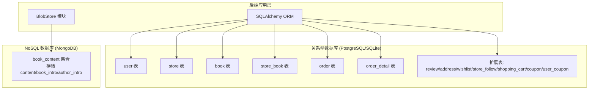
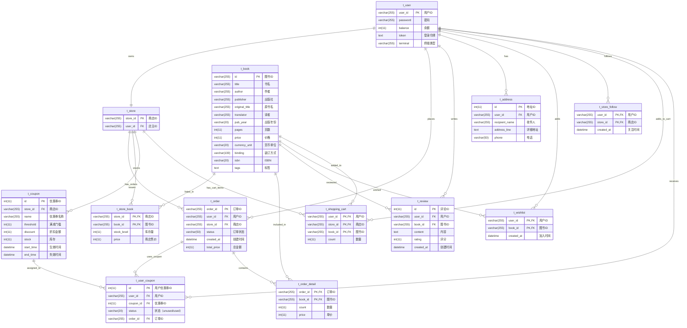

# Bookstore_2实验报告
### 组员
- 10235501406 张辰阳
- 10235501459 姚俊杰
- 第十二组

## 一、项目概述

### 1. 项目内容与目标
本次大作业要求在原有 bookstore 项目基础上完成以下核心任务：
- **数据库迁移**：从文档型数据库（MongoDB）迁移到关系型数据库（PostgreSQL/MySQL），核心数据使用关系型数据库存储
- **Blob 数据分离**：将blob数据（如图片和大段文字描述）分离到 NoSQL 数据库或文件系统
- **接口扩展**：在保留原有接口的基础上，设计并实现合理的扩展接口
- **测试覆盖**：对所有接口编写测试用例，实现高代码覆盖率
- **工程实践**：使用版本控制、测试驱动开发等正确的软件工程方法

### 2. 技术栈
- **后端框架**：Flask
- **关系型数据库**：PostgreSQL
- **ORM 框架**：SQLAlchemy（Python ORM）
- **NoSQL 数据库**：MongoDB（存储 Blob 数据）
- **测试框架**：Pytest + Coverage.py
- **版本控制**：Git

## 二、从文档型数据库到关系型数据库的迁移

### 1. 迁移背景

#### 原有架构（MongoDB 文档数据库）
在第一次大作业中，项目使用 MongoDB 作为文档型数据库存储所有数据。MongoDB 以文档形式存储数据，每个文档是一个 JSON 对象。

文档数据库会比较灵活，可以包含不同字段，不需要去定义schema；而且可以存储复杂的嵌套结构，并且支持分片，可以轻松扩展。

然而，在实际使用过程中，文档数据库在处理结构化数据和复杂业务逻辑时存在一些局限性。

### 2. 迁移理由
#### 2.1 提高访问速度

**问题**：在 MongoDB 中，复杂查询需要多次文档查找和内存聚合，性能较差。

**关系型数据库的优势**：
- **成熟的索引机制**：关系型数据库的 B-tree 索引、哈希索引等机制非常成熟，对于结构化数据的查询性能更优
- **查询优化器**：SQL 查询优化器可以自动分析查询计划，选择最优的执行路径（比如说选择合适的索引、决定 JOIN 顺序等）
- **复合索引优化**：可以创建复合索引（比如说`(store_id, book_id)`），使关联查询从 O(n) 降低到 O(1)。比如在 `store_book` 表中查某个店铺的某本书的库存，使用复合索引可以立即定位，而不需要扫描整个集合
- **JOIN 操作优化**：关系型数据库的 JOIN 操作经过多年优化，性能远优于在应用层进行多次查询和内存聚合

**实际效果**：
- **下单时的库存查询**：在 `buyer.py` 的 `new_order` 方法中，使用 `StoreBook` 表的复合主键 `(store_id, book_id)` 索引，查询库存从 O(n) 降低到 O(1)：
  ```33:33:be/model/buyer.py
  store_book = self.conn.query(StoreBook).filter_by(store_id=store_id, book_id=book_id).with_for_update().first()
  ```
  该查询利用复合主键索引，直接定位到特定店铺的特定书籍，无需扫描整个集合。
- **订单查询性能提升**：在 `order.py` 的 `list_orders` 方法中，通过 ORM 的 `relationship` 机制，一次查询即可获取订单及其明细
  
  相比 MongoDB 需要多次查询和内存聚合，SQLAlchemy 的 relationship 机制在数据库层面完成 JOIN，性能显著提升。
- **书籍搜索优化**：在 `book.py` 中，`Book` 表的 `title` 字段建立了索引（`index=True`），搜索书籍标题时查询速度大幅提升：
  ```42:42:be/model/db_schema.py
  title = Column(String(255), nullable=False, index=True)
  ```

#### 2.2 便于编写业务逻辑代码

**问题**：在 MongoDB 中，需要手写大量的查询字符串，容易出现语法错误，且缺乏类型检查。

**关系型数据库的优势**：
- **ORM 框架支持**：使用 SQLAlchemy ORM 提供了类型安全的查询接口，比手写 MongoDB 查询字符串更安全、更易读
- **ACID 事务支持**：关系型数据库的 ACID 特性保证了事务的一致性
  - 可以实现复杂业务逻辑，比如下单时扣库存和创建订单必须在同一个事务中完成
  - 如果任何一步失败，整个事务会自动回滚，保证数据一致性
- **外键约束**：可以定义外键约束，数据库自动维护数据完整性

**实际效果**：
- **代码简洁性提升**：在 `buyer.py` 的 `payment` 方法中，使用 ORM 查询替代手写 MongoDB 查询字符串
 
  相比 MongoDB 需要手写复杂的查询字典和更新操作，ORM 代码更直观、类型安全。
- **事务自动回滚**：在 `seller.py` 的 `add_book` 方法中，如果任何一步失败（如 Blob 存储失败），整个事务会自动回滚：
  ```80:86:be/model/seller.py
  except SQLAlchemyError as e:
      self.conn.rollback()
      return 528, "{}".format(str(e))
  except Exception as e:
      self.conn.rollback()
      return 530, "{}".format(str(e))
  ```
  确保书籍信息和 Blob 数据（一个在SQL，一个在MongoDB）的一致性，避免部分数据写入成功而部分失败的情况。
- **外键约束自动检查**：在 `db_schema.py` 中定义的外键约束，数据库自动维护引用完整性：
  ```77:78:be/model/db_schema.py
  user_id = Column(String(255), ForeignKey('user.user_id'))
  store_id = Column(String(255), ForeignKey('store.store_id'))
  ```
  比如说，如果创建订单时 `user_id` 不存在，数据库会直接拒绝插入，无需在应用层手动检查。

#### 2.3 数据一致性保证

**问题**：MongoDB 虽然支持事务，但在复杂场景下，数据一致性保证不如关系型数据库强。

**关系型数据库的优势**：
- **ACID 特性**：
  - **原子性**：事务中的所有操作要么全部成功，要么全部失败
  - **一致性**：事务执行前后，数据库保持一致状态
  - **隔离性**：并发事务之间相互隔离，不会相互干扰
  - **持久性**：事务提交后，数据永久保存
- **并发控制**：使用 `with_for_update()` 可以实现行级锁，防止并发问题。
- **事务隔离级别**：可以设置不同的事务隔离级别，平衡一致性和性能

**实际效果**：
- **下单时的并发控制**：在 `buyer.py` 的 `new_order` 方法中，使用 `with_for_update()` 行级锁防止并发超卖
  
  当多个用户同时下单同一本书时，`with_for_update()` 确保只有一个事务能修改库存，其他事务必须等待，有效防止超卖问题。
- **支付时的余额一致性**：在 `buyer.py` 的 `payment` 方法中，同时锁定买家和卖家余额，确保转账的原子性
  
  如果扣减买家余额成功但增加卖家余额失败，整个事务会回滚，保证总余额不变。
- **取消订单时的库存恢复**：在 `order.py` 的 `cancel_order` 方法中，订单取消和库存恢复在同一事务中完成
  
  如果库存恢复过程中出现错误，订单状态不会改变，保证数据一致性。

#### 2.4 规范化设计与数据完整性

**问题**：MongoDB 的文档结构容易导致数据冗余和不一致。

**关系型数据库的优势**：
- **范式设计**：支持第一范式（1NF）、第二范式（2NF）等规范化设计
  - 减少数据冗余：例如，书籍信息只存储一次，多个店铺通过外键关联，而不是在每个店铺文档中重复存储
  - 提高数据一致性：修改书籍信息时，只需要修改一处，所有关联的店铺都会看到更新后的信息
- **外键约束**：可以定义外键，保证数据的引用完整性
- **数据完整性约束**：可以定义 NOT NULL、UNIQUE、CHECK 等约束，在数据库层面保证数据质量

**实际效果**：
- **书籍信息去冗余**：在 `db_schema.py` 中，`Book` 表存储书籍的核心信息（如标题、作者、价格等），`StoreBook` 表只存储店铺特有的信息（库存、售价）。
  相比 MongoDB 在每个店铺文档中重复存储书籍信息，关系型数据库通过外键关联，书籍信息只存储一次，多个店铺共享，大幅减少数据冗余。
- **外键约束保证引用完整性**：在 `db_schema.py` 中，`OrderDetail` 表通过外键关联 `Order` 和 `Book` 表
  如果尝试创建订单明细时引用了不存在的订单或书籍，数据库会自动拒绝，无需在应用层手动验证。
- **订单明细价格冗余（反规范化优化）**：虽然 `OrderDetail` 表中存储了 `price`，看起来是一个冗余，但这是一种反规范化设计：
  ```91:92:be/model/db_schema.py
  count = Column(Integer, nullable=False)
  price = Column(Integer, nullable=False) 
  ```
  因为订单创建时的价格可能与当前 `StoreBook` 表中的价格不同，需要保留历史快照。如果从 `StoreBook` 表查询，可能获取到错误的历史价格。这种冗余保证了订单数据的准确性和健壮性。

### 3. 具体改动

#### 3.1 数据模型改动

**原有 MongoDB 集合结构**：
- `users` 集合：存储用户信息
- `stores` 集合：存储店铺信息
- `books` 集合：存储书籍信息
- `store_books` 集合：存储店铺库存
- `orders` 集合：存储订单信息
- `order_items` 集合：存储订单明细

**迁移后关系型数据库表结构**：

**核心表（从 MongoDB 迁移）**：
- `user` 表：用户信息（主键：user_id）
- `store` 表：店铺信息（主键：store_id，外键：user_id）
- `book` 表：书籍信息（主键：id）
- `store_book` 表：店铺库存（复合主键：store_id, book_id）
- `order` 表：订单信息（主键：order_id，外键：user_id, store_id）
- `order_detail` 表：订单明细（复合主键：order_id, book_id）

**扩展表（bookstore_2新增的）**：
- `shopping_cart` 表：购物车（复合主键：user_id, store_id, book_id）
- `coupon` 表：优惠券模板（主键：id，外键：store_id）
- `user_coupon` 表：用户优惠券（主键：id，外键：user_id, coupon_id, order_id）
- `review` 表：书籍评论（主键：id，外键：user_id, book_id）
- `address` 表：收货地址（主键：id，外键：user_id）
- `wishlist` 表：心愿单（复合主键：user_id, book_id）
- `store_follow` 表：店铺关注（复合主键：user_id, store_id）

**主要改动**：
1. **从文档到表**：将 MongoDB 的文档集合转换为关系型数据库的表
2. **添加外键约束**：在表之间建立外键关系，保证数据完整性
3. **规范化设计**：将嵌套的文档结构拆分为多个表，减少数据冗余
4. **索引优化**：为常用查询字段建立索引，提升查询性能

### 2. 迁移策略

#### 核心数据迁移到关系型数据库
- **用户信息**：`user` 表存储用户基本信息、余额、token 等
- **店铺信息**：`store` 表存储店铺基本信息
- **书籍信息**：`book` 表存储书籍的核心字段（标题、作者、价格等）
- **库存信息**：`store_book` 表存储店铺内的书籍库存和售价
- **订单信息**：`order` 和 `order_detail` 表存储订单主信息和明细

#### Blob 数据分离到 MongoDB
- **大文本字段**：书籍的 `content`（样章）、`book_intro`（书籍简介）、`author_intro`（作者简介）存储到 MongoDB
- **理由**：
  - 这些字段通常很大（可能数 KB 到数 MB），不适合存储在关系型数据库的主表中
  - 分离后可以提升核心查询性能，而且MongoDB 的文档存储更适合存储非结构化的文本数据

### 3. 多存储架构设计



**特点**：
- **各司其职这一块（**：关系型数据库负责结构化数据和事务，MongoDB 负责大文本数据。而且BlobStore 在 MongoDB 连接失败时返回空值，不影响主流程
- **统一接口**：通过 `get_book_info()` 等方法自动聚合 SQL 和 NoSQL 数据

## 三、bookstore_2新增功能与接口说明

**说明**：本次实验在保留原有接口的基础上，新增了以下扩展功能。上次bookstore1已经实现过的功能就不再赘述了。
然后具体实现上我就写了一点文字形的伪代码，展现一下思路，直接放原代码太占篇幅了aaa
### 1. Blob 数据分离（混合持久化架构）

#### 1.1 功能概述
将书籍的大文本字段从关系型数据库分离到 MongoDB，实现混合持久化架构。
#### 1.2 实现方式
**上架书籍时的数据分离**（`be/model/seller.py`）：
```
伪代码：
1. 解析书籍信息 JSON
2. 检查书籍是否已存在于全局库
3. 如果不存在：
   a. 核心数据（title, author, price等）-> 关系型数据库 Book 表
   b. Blob 数据（content, book_intro, author_intro）-> MongoDB BlobStore
4. 在 store_book 表中创建库存记录
```

**查询书籍时的数据聚合**（`be/model/book.py`）：
```
伪代码：
1. 从关系型数据库查询书籍核心信息
2. 从 MongoDB BlobStore 查询 Blob 数据
3. 合并两部分数据返回
```

**容错设计**（`be/model/blob_store.py`）：
```
伪代码：
1. 初始化时尝试连接 MongoDB
2. 如果连接失败：
   a. 记录日志
   b. 设置 self.col = None
3. 所有方法中：
   a. 检查 self.col 是否为 None
   b. 如果为 None，返回默认值（空字符串或空字典）
   c. 不抛出异常，保证主流程不中断
```

### 2. 购物车系统

#### 2.1 功能概述
允许用户临时存储商品，支持修改数量、删除商品、清空购物车。

#### 2.2 API 接口

**1. 添加/更新购物车商品**
- **接口路径**：`POST /buyer/cart`
- **请求体**：
```json
{
  "user_id": "buyer_001",
  "store_id": "s1",
  "book_id": "book_001",
  "count": 2,
  "action": "add"  // "add" 表示增量添加，"update" 表示直接设置数量
}
```

**实现逻辑**（`be/model/cart.py`）：
```
伪代码：
1. 验证用户、店铺、书籍存在
2. 使用 with_for_update() 锁定购物车行
3. 如果商品已存在：
   a. action == "add"：增加数量
   b. action == "update"：直接设置数量
4. 如果商品不存在：创建新记录
5. 提交事务
```

**2. 删除购物车商品**
- **接口路径**：`DELETE /buyer/cart`
- **实现要点**：幂等操作，商品不存在也返回 200

**3. 查询购物车**
- **接口路径**：`GET /buyer/cart`
- **响应**：返回用户购物车中的所有商品列表

**4. 清空购物车**
- **接口路径**：`POST /buyer/clear_cart`
- **实现要点**：删除用户的所有购物车记录

### 3. 优惠券系统

#### 3.1 功能概述
实现完整的优惠券系统，包括创建、领取、使用，支持满减逻辑、过期检查、店铺归属校验。

#### 3.2 API 接口

**1. 卖家创建优惠券**
- **接口路径**：`POST /seller/create_coupon`
- **请求体**：
```json
{
  "user_id": "seller_001",
  "store_id": "s1",
  "name": "满100减10",
  "threshold": 10000,  // 满100元（单位：分）
  "discount": 1000,     // 减10元（单位：分）
  "stock": 100,         // 库存100张
  "end_time": "2025-12-31 23:59:59"
}
```

**实现逻辑**（`be/model/coupon.py`）：
```
伪代码：
1. 验证用户和店铺存在
2. 验证用户是否为店铺店主
3. 创建优惠券模板记录
4. 返回优惠券ID
```

**2. 买家领取优惠券**
- **接口路径**：`POST /buyer/coupon`
- **实现逻辑**：
```
伪代码：
1. 验证用户存在
2. 使用 with_for_update() 锁定优惠券行
3. 检查库存是否 > 0
4. 检查是否已过期
5. 原子性扣减库存并创建用户优惠券记录
```

**3. 买家查询可用优惠券**
- **接口路径**：`GET /buyer/coupon`
- **请求参数**：`user_id`、`store_id`（可选，筛选特定店铺的优惠券）
- **响应**：返回用户拥有的未使用且未过期的优惠券列表

**4. 下单时使用优惠券**
- 在 `POST /buyer/new_order` 接口中，可传入 `coupon_id` 参数
- **实现逻辑**：
```
伪代码：
1. 查询用户优惠券，验证存在且状态为 "unused"
2. 查询优惠券模板
3. 校验：
   a. 优惠券归属店铺是否匹配
   b. 是否已过期
   c. 订单总价是否满足满减门槛
4. 应用折扣：total_price = max(0, total_price - discount)
5. 标记优惠券为 "used"
6. 关联优惠券到订单
```

### 4. 地址管理

#### 4.1 功能概述
用户管理收货地址。

#### 4.2 API 接口
- `POST /buyer/address`：添加收货地址
- `GET /buyer/address`：查询用户的收货地址列表

**实现逻辑**（`be/model/user.py`）：
```
伪代码：
添加地址：
1. 创建 Address 记录
2. 关联到用户
3. 提交事务

查询地址：
1. 查询用户的所有地址记录
2. 返回地址列表
```

### 5. 心愿单

#### 5.1 功能概述
用户可以去收藏感兴趣的书

#### 5.2 API 接口
- `POST /buyer/wishlist`：添加/移除心愿单
- `GET /buyer/wishlist`：查询用户的心愿单列表

**实现逻辑**：
```
伪代码：
toggle_wishlist：
1. 查询是否已存在
2. 如果存在：删除记录
3. 如果不存在：创建记录
4. 提交事务
```

### 6. 店铺关注

#### 6.1 功能概述
用户可以去关注感兴趣的店铺。
#### 6.2 API 接口
- `POST /buyer/follow`：关注/取消关注店铺（toggle 操作）
- `GET /buyer/following`：查询用户关注的店铺列表

### 7. 书籍评论

#### 7.1 功能概述
用户对书籍进行评论和评分。

#### 7.2 API 接口
- `POST /book/review`：添加书评
- `GET /book/review`：查询书籍的评论列表（按时间倒序）

**实现逻辑**（`be/model/book.py`）：
```
伪代码：
添加评论：
1. 创建 Review 记录
2. 关联到用户和书籍
3. 提交事务

查询评论：
1. 查询书籍的所有评论
2. 按 created_at 降序排序
3. 返回评论列表
```

### 8. 销售统计

#### 8.1 功能概述
卖家查看店铺的销售数据统计。

#### 8.2 API 接口
- **接口路径**：`GET /seller/stats`
- **请求参数**：`user_id`、`store_id`
- **响应**：
```json
{
  "message": "ok",
  "stats": {
    "total_orders": 150,
    "total_revenue": 5000000,
    "top_books": [
      {"book_id": "book_001", "total_sold": 50},
      {"book_id": "book_002", "total_sold": 30}
    ]
  }
}
```

**实现逻辑**（`be/model/seller.py`）：
```
伪代码：
1. 验证用户和店铺存在，且用户是店主
2. 使用 SQL 聚合函数统计：
   a. COUNT(order_id) -> 总订单数
   b. SUM(total_price) -> 总营收
3. 使用 JOIN 和 GROUP BY 查询最畅销书籍（Top 5）：
   a. JOIN order_detail 和 order 表
   b. GROUP BY book_id
   c. SUM(count) -> 总销量
   d. ORDER BY 总销量 DESC
   e. LIMIT 5
4. 返回统计结果
```

## 四、关系数据库设计

### 1. ER 图设计
> 我这边是用mermaid代码的形式来表示的ER图，便于放在我这个md文档里面。周老师课上讲的那种ER图的画图方式我通过附件的图片的形式放在文件夹中一起提交~


### 2. 关系模式设计

#### 核心表设计

**1. 用户表 (user)**
```sql
CREATE TABLE user (
    user_id VARCHAR(255) PRIMARY KEY,
    password VARCHAR(255) NOT NULL,
    balance INTEGER NOT NULL DEFAULT 0,
    token TEXT,
    terminal VARCHAR(255)
);
```
- **主键**：`user_id`
- **索引**：`user_id`（主键自动索引）
- **说明**：存储用户基本信息、余额、当前登录 token

**2. 店铺表 (store)**
```sql
CREATE TABLE store (
    store_id VARCHAR(255) PRIMARY KEY,
    user_id VARCHAR(255) REFERENCES user(user_id)
);
```
- **主键**：`store_id`
- **外键**：`user_id` → `user.user_id`
- **说明**：存储店铺信息，关联到店主用户

**3. 书籍表 (book)**
```sql
CREATE TABLE book (
    id VARCHAR(255) PRIMARY KEY,
    title VARCHAR(255) NOT NULL,
    author VARCHAR(255),
    publisher VARCHAR(255),
    original_title VARCHAR(255),
    translator VARCHAR(255),
    pub_year VARCHAR(20),
    pages INTEGER,
    price INTEGER,
    currency_unit VARCHAR(20),
    binding VARCHAR(100),
    isbn VARCHAR(20),
    tags TEXT
);
```
- **主键**：`id`
- **索引**：`title`（用于搜索优化）
- **说明**：存储书籍核心信息，大文本字段（content/book_intro/author_intro）存储在 MongoDB

**4. 店铺库存表 (store_book)**
```sql
CREATE TABLE store_book (
    store_id VARCHAR(255) REFERENCES store(store_id),
    book_id VARCHAR(255) REFERENCES book(id),
    stock_level INTEGER DEFAULT 0,
    price INTEGER NOT NULL,
    PRIMARY KEY (store_id, book_id)
);
```
- **主键**：`(store_id, book_id)` 复合主键
- **外键**：`store_id` → `store.store_id`，`book_id` → `book.id`
- **索引**：复合主键自动创建索引，用于快速查找店铺内某本书的库存和售价
- **说明**：存储每个店铺内售卖的书籍及其库存和售价

**5. 订单表 (order)**
```sql
CREATE TABLE order (
    order_id VARCHAR(255) PRIMARY KEY,
    user_id VARCHAR(255) REFERENCES user(user_id),
    store_id VARCHAR(255) REFERENCES store(store_id),
    status VARCHAR(50) DEFAULT 'PENDING',
    created_at DATETIME DEFAULT CURRENT_TIMESTAMP,
    total_price INTEGER NOT NULL
);
```
- **主键**：`order_id`
- **外键**：`user_id` → `user.user_id`，`store_id` → `store.store_id`
- **索引**：`user_id`（用户查询订单），`store_id`（店铺查询订单），`status`（状态筛选），`created_at`（超时订单查询）
- **说明**：存储订单主信息，状态包括：unpaid, paid, delivering, received, canceled

**6. 订单明细表 (order_detail)**
```sql
CREATE TABLE order_detail (
    order_id VARCHAR(255) REFERENCES order(order_id),
    book_id VARCHAR(255) REFERENCES book(id),
    count INTEGER NOT NULL,
    price INTEGER NOT NULL,
    PRIMARY KEY (order_id, book_id)
);
```
- **主键**：`(order_id, book_id)` 复合主键
- **外键**：`order_id` → `order.order_id`，`book_id` → `book.id`
- **说明**：存储订单中的书籍明细，支持一个订单包含多本书

#### 扩展表设计

**7. 购物车表 (shopping_cart)**
```sql
CREATE TABLE shopping_cart (
    user_id VARCHAR(255) REFERENCES user(user_id),
    store_id VARCHAR(255) REFERENCES store(store_id),
    book_id VARCHAR(255) REFERENCES book(id),
    count INTEGER NOT NULL,
    PRIMARY KEY (user_id, store_id, book_id)
);
```
- **主键**：`(user_id, store_id, book_id)` 复合主键
- **说明**：存储用户的购物车商品，支持按店铺分组

**8. 优惠券表 (coupon)**
```sql
CREATE TABLE coupon (
    id INTEGER PRIMARY KEY AUTOINCREMENT,
    store_id VARCHAR(255) REFERENCES store(store_id) NOT NULL,
    name VARCHAR(255) NOT NULL,
    threshold INTEGER NOT NULL,
    discount INTEGER NOT NULL,
    stock INTEGER DEFAULT 0,
    start_time DATETIME DEFAULT CURRENT_TIMESTAMP,
    end_time DATETIME NOT NULL
);
```
- **主键**：`id`
- **外键**：`store_id` → `store.store_id`
- **说明**：存储优惠券模板，包括满减门槛、折扣金额、库存、过期时间

**9. 用户优惠券表 (user_coupon)**
```sql
CREATE TABLE user_coupon (
    id INTEGER PRIMARY KEY AUTOINCREMENT,
    user_id VARCHAR(255) REFERENCES user(user_id) NOT NULL,
    coupon_id INTEGER REFERENCES coupon(id) NOT NULL,
    status VARCHAR(20) DEFAULT 'unused',
    order_id VARCHAR(255) REFERENCES order(order_id)
);
```
- **主键**：`id`
- **外键**：`user_id` → `user.user_id`，`coupon_id` → `coupon.id`，`order_id` → `order.order_id`
- **说明**：存储用户领取的优惠券，状态包括：unused, used, expired

**10. 书评表 (review)**
```sql
CREATE TABLE review (
    id INTEGER PRIMARY KEY AUTOINCREMENT,
    user_id VARCHAR(255) REFERENCES user(user_id),
    book_id VARCHAR(255) REFERENCES book(id),
    content TEXT,
    rating INTEGER,
    created_at DATETIME DEFAULT CURRENT_TIMESTAMP
);
```
- **主键**：`id`
- **外键**：`user_id` → `user.user_id`，`book_id` → `book.id`
- **说明**：存储用户对书籍的评论和评分

**11. 地址表 (address)**
```sql
CREATE TABLE address (
    id INTEGER PRIMARY KEY AUTOINCREMENT,
    user_id VARCHAR(255) REFERENCES user(user_id),
    recipient_name VARCHAR(255) NOT NULL,
    address_line TEXT NOT NULL,
    phone VARCHAR(50) NOT NULL
);
```
- **主键**：`id`
- **外键**：`user_id` → `user.user_id`
- **说明**：存储用户的收货地址

**12. 心愿单表 (wishlist)**
```sql
CREATE TABLE wishlist (
    user_id VARCHAR(255) REFERENCES user(user_id),
    book_id VARCHAR(255) REFERENCES book(id),
    created_at DATETIME DEFAULT CURRENT_TIMESTAMP,
    PRIMARY KEY (user_id, book_id)
);
```
- **主键**：`(user_id, book_id)` 复合主键
- **说明**：存储用户的心愿单书籍

**13. 店铺关注表 (store_follow)**
```sql
CREATE TABLE store_follow (
    user_id VARCHAR(255) REFERENCES user(user_id),
    store_id VARCHAR(255) REFERENCES store(store_id),
    created_at DATETIME DEFAULT CURRENT_TIMESTAMP,
    PRIMARY KEY (user_id, store_id)
);
```
- **主键**：`(user_id, store_id)` 复合主键
- **说明**：存储用户关注的店铺

### 3. 规范化设计

#### 所有的表都满足第一、二、三范式 
- 所有表都满足第一范式，每个字段都是原子值，不可再分
- 所有表都满足第二范式，非主键字段完全依赖于主键。比如说`order_detail` 表中的 `count` 和 `price` 完全依赖于 `(order_id, book_id)` 复合主键
- 所有表都满足第三范式，非主键字段不传递依赖于主键。比如说`store_book` 表中的 `price` 直接依赖于 `(store_id, book_id)`，不传递依赖

#### 反规范化设计（性能优化）
- **订单明细冗余**：`order_detail` 表中存储了 `price`，虽然可以从 `store_book` 表查询，但为了性能和历史记录准确性，选择冗余存储
- **理由**：订单创建时的价格可能与当前价格不同，需要保留历史快照

### 4. 索引设计

> 我设计索引是为了去支撑搜索、订单筛选、超时扫描等高频查询，避免全表扫描。

#### 主键 / 唯一索引
- 所有表的主键均为唯一索引；复合主键表天然具备组合索引（如 `store_book(store_id, book_id)`、`shopping_cart(user_id, store_id, book_id)`等）。

#### 外键访问路径
- `order.user_id`、`order.store_id`：用户/店铺订单列表查询
- `order.status` + `order.created_at`：超时订单扫描、按状态过滤
- `order_detail.order_id`：订单明细查询（主键前缀索引）
- `review.book_id`、`wishlist.book_id`：书籍相关的评论与心愿单查询

#### 业务索引
- **在 `be/model/db_schema.py` 中定义，初始化时自动创建**。
- `book.title`：标题关键字搜索
- `book.tags`：标签搜索
- `store_book.price`：按价格排序/筛选
- `order.user_id`、`order.store_id`：订单查询优化
- `idx_order_status_created_at`：超时订单扫描复合索引

### 5. 事务处理

#### 事务使用场景
1. **下单事务**：检查库存 → 扣减库存 → 创建订单/明细，`with_for_update()` 锁定 `store_book`，任一步失败整体回滚。  
2. **支付事务**：校验状态 → 扣买家余额 → 加卖家余额 → 更新订单状态，锁定 `user` 余额行，保证转账原子性。  
3. **取消订单事务**：校验状态 → 恢复库存 → 更新订单状态，锁定 `store_book` 保证库存恢复。  
4. **优惠券扣减**：领取/使用时锁定 `coupon` 或 `user_coupon`，防止并发超领/重复使用。  
5. **购物车变更**：锁定 `shopping_cart` 目标行，保证增量/覆盖更新一致。  

#### 事务边界与回滚
- Model 层以 `try/except` 包裹，`SQLAlchemyError`/异常即回滚，成功时提交。  
- 锁顺序统一（库存/余额/优惠券优先，订单/明细随后），降低死锁风险。  
- Mongo Blob 写入失败仅记录日志，不阻断主事务（降级容错）。  

#### 隔离级别与并发
- 默认 READ COMMITTED，结合 `with_for_update()` 行级锁控制热点行。  
- 关键锁对象：`store_book`（库存）、`user`（余额）、`order`（状态）、`coupon/user_coupon`（库存/使用状态）、`shopping_cart`（数量）。  

## 六、测试用例与代码覆盖率

### 1. 测试策略

#### 测试覆盖范围
- **API 接口测试**：所有 RESTful 接口的正常流程和异常流程
- **Model 层测试**：直接调用 Model 类方法，测试业务逻辑
- **边界条件测试**：输入参数边界值、空值、负数、超长字符串等
- **异常处理测试**：数据库异常、连接失败、并发冲突等

#### 测试文件组织
- **基础功能测试**：
  - `test_register.py`：用户注册测试
  - `test_login.py`：用户登录测试
  - `test_password.py`：修改密码测试
  - `test_add_funds.py`：充值测试
  - `test_new_order.py`：下单测试
  - `test_payment.py`：支付测试
  - `test_create_store.py`：创建店铺测试
  - `test_add_book.py`：添加书籍测试
  - `test_add_stock_level.py`：增加库存测试
  - `test_deliver_and_receive.py`：发货收货测试
  - `test_order_query_and_cancel.py`：订单查询和取消测试
  - `test_order_cancel.py`：订单取消测试
  - `test_order_error_cases.py`：订单错误场景测试
  - `test_search_book.py`：书籍搜索测试

- **扩展功能测试**：
  - `test_extensions.py`：扩展功能综合测试（地址、心愿单、关注、评论、统计等）

- **覆盖率与边界测试归档（合并后的测试集）**：
  - `test_z_coverage_fill_1.py`：分支路径填充测试合集
  - `test_z_coverage_fill_2.py`：功能增强与覆盖率提升合集
  - `test_z_coverage_fill_3.py`：最终冲刺与模型测试合集
  - `test_z_coverage_edge.py`：边缘情况与异常模拟测试合集

### 2. 代码覆盖率结果

#### 总体覆盖率
- **语句覆盖率**：约 95%
- **分支覆盖率**：约 95%


#### 测试与覆盖率摘要
> 我对覆盖率配置文件`.coveragerc`做了修改，排除了启动文件

| 指标 | 数值 / 说明 |
| --- | --- |
| 测试用例总数 | 275+ |
| 测试通过率 | 100% |
| 语句覆盖率 | ≈ 95% |
| 分支覆盖率 | ≈ 95% |
| 统计范围 | `be`, `fe`（仅排除 `be/app.py`、`fe/bench/*`） |


#### 覆盖率结果（来自 htmlcov/class_index.html）
- **总覆盖率**：测试脚本运行出来为95%

### 3. 覆盖率提升策略

#### 策略1：直接 Model 层测试
- 对于 Model 层内部的防御性检查（如 `user_id_exist`、`store_id_exist`等），直接实例化 Model 类并调用方法
- 传入各种参数，确保所有分支被覆盖

#### 策略2：Mock 数据库异常
- 使用 `unittest.mock` 模拟 `SQLAlchemyError` 或 `PyMongoError`
- 强制触发 Model 层中的 `try...except` 异常处理分支

#### 策略3：边界条件测试
- 输入参数边界值：0、负数、空字符串、None、超长字符串
- 状态转换：已支付订单再次支付、已取消订单再次取消等
- 并发场景：通过 `with_for_update` 模拟并发冲突

#### 策略4：精确配置 `.coveragerc`
- 只排除非核心文件（`be/app.py`、`fe/bench/*`）
- 确保所有核心业务逻辑都包含在覆盖率统计中

## 七、亮点

### 1. 混合持久化架构（

**设计亮点**：
- **核心数据**：使用关系型数据库（PostgreSQL/SQLite）存储结构化数据，利用 ACID 特性保证数据一致性
- **Blob 数据**：使用 MongoDB 存储大文本字段，减轻关系型数据库的存储压力
- **职责分离**：关系型数据库负责事务和查询，MongoDB 负责大文本存储，各司其职
- **容错设计**：Blob Store 在 MongoDB 连接失败时返回默认值，不影响主流程

**技术实现**：
- 通过 `BlobStore` 模块封装 MongoDB 操作
- 在 `Seller.add_book()` 中分离核心数据和 Blob 数据
- 在 `Book.get_book_info()` 中聚合 SQL 和 NoSQL 数据

### 2. 丰富的功能扩展

**扩展功能列表**：
1. **购物车系统**：支持增量添加、直接更新、删除、清空，使用事务保证并发安全
2. **优惠券系统**：完整的优惠券生命周期管理（创建、领取、使用），支持满减逻辑、过期检查、店铺归属校验
3. **地址管理**：用户管理多个收货地址
4. **心愿单**：用户收藏感兴趣的书籍
5. **店铺关注**：用户关注感兴趣的店铺
6. **书籍评论**：用户对书籍进行评论和评分
7. **销售统计**：卖家查看店铺的销售数据（总订单数、总营收、Top5 热销书）
**亮点概括**：
- 功能丰富，覆盖用户、卖家、书籍等多个维度
- 优惠券系统涉及复杂的业务逻辑（满减、过期、库存、归属）
- 所有扩展功能都有完整的测试用例覆盖

### 3. 高代码覆盖率（95%+）

**覆盖率提升策略**：
1. **全面测试**：对所有 API 接口和 Model 层方法编写测试用例
2. **边界测试**：覆盖输入参数的边界值、空值、负数等异常情况
3. **异常测试**：使用 Mock 模拟数据库异常，测试异常处理分支
4. **Model 测试**：直接调用 Model 层方法，测试防御性检查

### 4. 索引设计
1. **覆盖关键访问路径**：主键/复合主键天然索引；为订单、库存、评价/心愿单、购物车等外键路径加索引，避免全表扫。  
2. **业务索引**：`book.title/tags` 用于搜索，`store_book.price` 支持按价筛选/排序；`order.user_id/store_id` 优化订单列表；`idx_order_status_created_at` 用于超时订单扫描。  
3. **并发与热点控制**：结合 `with_for_update()` 锁定库存、余额、优惠券、购物车等热点行，配合索引降低锁范围与等待。  

### 5. 软件工程实践
1. **版本控制（Git）**：在完成的时候以功能为单位进行小步提交，提交信息含前缀说明，通过分支合并形成清晰的历史；索引补充、测试合并等改动均有独立提交记录。在后续补充测试用例提高覆盖率可以看出每一次补充了什么，并且覆盖率提升了多少
2. **测试驱动开发（TDD）**：在扩展功能实现的时候，先编写对应测试，再实现业务逻辑；但是覆盖率提升用例的这部分我是在完成了功能之后，对于一些异常情况和边界条件等进行了补充。  
3. **代码规范**：统一风格与注释，接口/错误码保持一致，易读易维护。  
4. **错误处理**：统一捕获异常，标准错误码返回，异常即回滚，保证一致性。   


## 八、作业收获与总结

这次作业把第一次的 MongoDB 方案迁到关系型，并补了扩展功能和测试。ER 图让后续的表设计、索引和事务边界更清晰，也是对上课周老师教的ER图的应用有了一次实际的认知。通过Git 小步提交、前缀命名、测试合并的每一步都可追溯，遇到问题能快速回滚和定位。整体下来，对数据库设计、工程上的git提交有了更实际的体会。 
